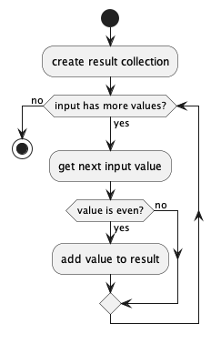

# Collection Loop Benchmark

The submodules of this repository contain benchmarks to measure different kind of loops over collections. The benchmarks are available for Java, C++ and Golang.

As input to the algorithm shown above a collection with increasing numbers is used. The algorithm adds the even numbers of the input collection to the result collection. It filters out odd numbers from the input collection.

In addition to measuring the performance, the memory usage is measured as well (i.e. result collection and lambda expressions).

- [Java Benchmark](java-benchmark)
- [C++ Benchmark](cpp-benchmark)
- [Golang Benchmark](golang-benchmark)
